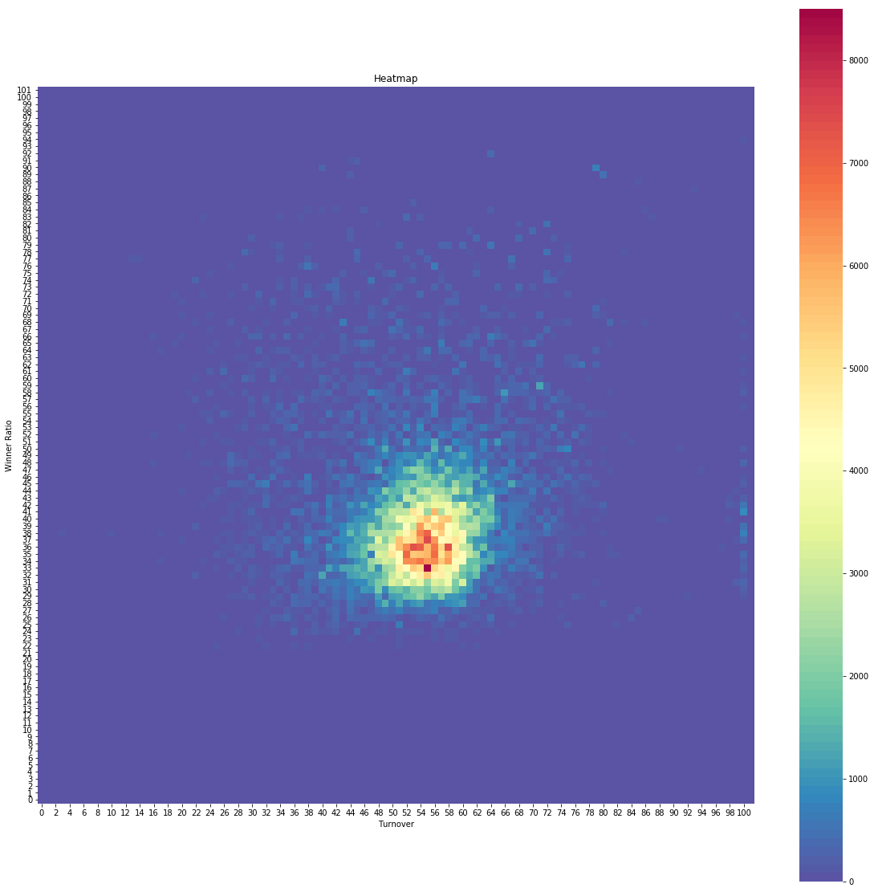

# Result / Turover Heatmaps

Analysis inspired by the methodology in **Statistical fingerprints of electoral fraud?**
<https://doi.org/10.1111/j.1740-9713.2016.00936.x>

Result-Turnover hheatmaps for Bulgariaan elections

##ep2019
  

##mi2015os
      

##mi2019os
           
##pi2017
     

##pvnr2016-tur2-gerb
 

##pvnr2016-tur2-radev
