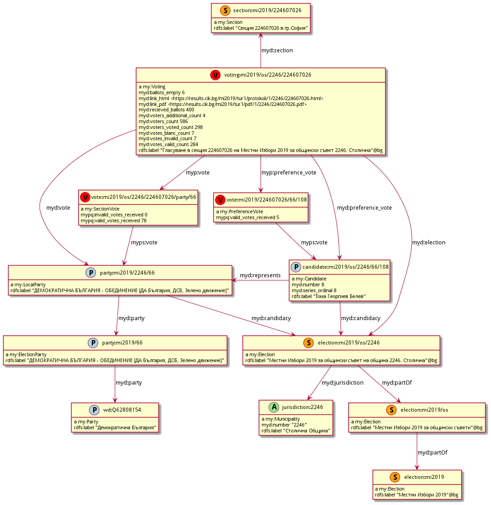

# Semantic Elections Data Model 

This folder contains the data model

## High-level Model

### URI design

<https://elections.ontotext.com/resource/voting/mi2019/ko/tur1/0101/010100002>
uri pattern is as follows

| element         | example                                   | 
|-----------------|-------------------------------------------|
| BASE            | https://elections.ontotext.com/resource/  |
| Entity type     | voting                                    |
| Election        | mi2019                                    |
| _Election type_ | ko                                        |
| _Election round_| tur1                                      |
| _Jurisdiction_  | 0101                                      |
| Section         | 010100002                                 |

## Votes and Preference Votes

## Candidacy Across Elections

## Places

